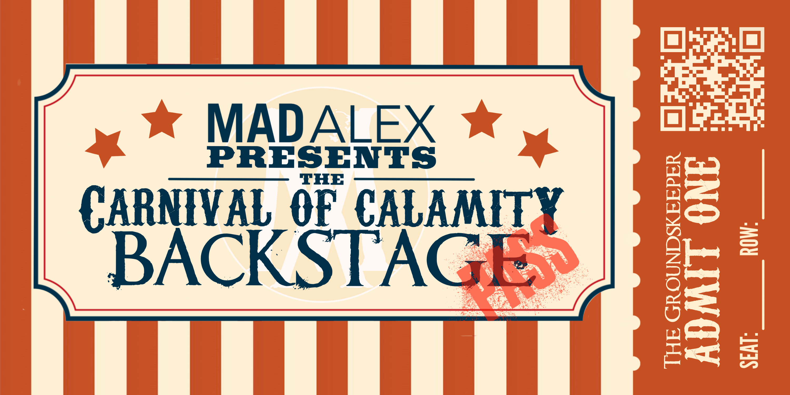

  
   
   
  

    •
    <a href="https://bsky.app/profile/madalexxx.xyz">Mad Alex on Bluesky</a>
    •
    <a href="https://discord.gg/T3xvs27eUM">The Mad Alex Discord Server</a>
    •
  

 

  <h1>There's backstage, and then there's <i>backstage</i> backstage.</h1>
  Are you lost? I think, perhaps, you may be lost. Listen, I completely 
  understand: backstage can be cool. You almost feel like a VIP when you're 
  wandering around backstage. You get to see all the bustle and the excitement 
  of what goes on behind the curtains as performers prepare their magic with 
  which to dazzle you. Are you interested in <i>that</i> kind of backstage? If 
  so, here's a free ticket to <i>that</i> kind of backstage:
   
   
  

  
  

   
  I think you will find <i>that</i> kind of backstage far more entertaining. 
  This here that you're looking at? This is the <i>backstage</i> backstage. 
  This is the office backstage. This is where projects and kanban boards and 
  sticky notes make their home. Where words like "agile" and "scrum" are 
  thrown around unironically and immediately thrown in the trash overflowing 
  with crumpled up paper and used up ball point pens. This is where the break 
  room is lined with linoleum, glaring flourescents, weak coffee, and day-old 
  doughnuts. This is where backroom deals are struck with performers made to 
  appear glamorous by Hollywood but really are nothing more than two or three 
  disgruntled managers and hopefuls trying desperately to negotiate a contract 
  neither of them will hate.
   
   
  In other words, this is where you don't wanna be unless you work here.

 

  Now, perhaps I can interest you in one of our many shows? We currently have 
  a number of them by which you may find yourself greatly entertained! Please, 
  select from any of them. Tickets are not expensive, I assure you, and I 
  daresay you may find the entertainment exceeds the price!
   
   
  

    <h1>Vegas Rift</h1>
    <b>A Tale from the Odds-n-Endings Boutique</b> 
    An old woman risks everything to find her long lost husband. 
    <a
      href="http://books.apple.com/us/book/id6692634424">
        Apple Books
    </a>
    •
    <a
      href="https://www.barnesandnoble.com/w/vegas-rift-mad-alex/1146410990?ean=2940185809808">
        Barnes & Noble
    </a>
     
     
    <h1>Showdown at Sunrise</h1>
    <b>A Tale from the Odds-n-Endings Boutique</b> 
    A merchant finds himself in a heap of trouble after winning a gunfight out 
    of sheer luck. He’s willing to trade away everything he owns for a chance 
    at getting out of it, but the bargain he makes takes a wild turn. 
    <a
      href="http://books.apple.com/us/book/id6741198308">
        Apple Books
    </a>
    •
    <a
      href="https://www.barnesandnoble.com/w/showdown-at-sunrise-mad-alex/1146930192?ean=2940184539683">
        Barnes & Noble
    </a>
     
     
    <h1>Calypso</h1>
    <b>A Tale from the Odds-n-Endings Boutique</b> 
    Some gifts are better left untouched, for they pay dividends for eternity. 
    One person learned the hard way; when they sought answers, they learned 
    everyone before them learned the hard way as well. 
    <a
      href="http://books.apple.com/us/book/id6742083639">
        Apple Books
    </a>
    •
    <a
      href="https://www.barnesandnoble.com/w/calypso-mad-alex/1147035473?ean=2940184455297">
        Barnes & Noble
    </a>
     
  

   

Happy reading! And please do reach out if you have inquiries. [Bluesky][bsky] 
and [Discord][discord] are two ways to find us. If you venture to the fun 
backstage (the actual fun one, not this page), a reply to any of our emails 
will get our attention! We are always just so thrilled to hear from our fans!
 
 
 
This organization is managed by [L V N A C Y][lvnacy]. For developer inquiries
, please reach out to them.

<!-- links -->
[bsky]: https://bsky.app/profile/madalexxx.xyz
[discord]: https://discord.gg/T3xvs27eUM
[lvnacy]: https://github.com/ephemeralrogue